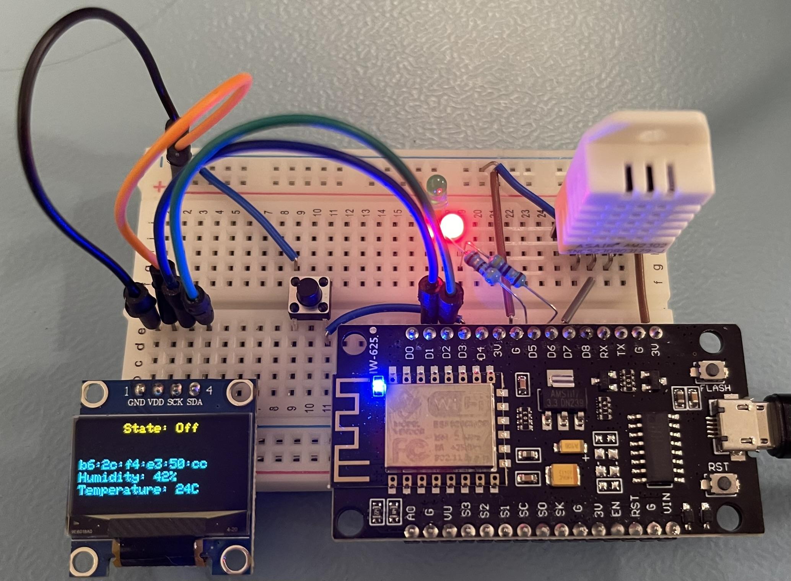
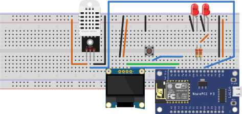
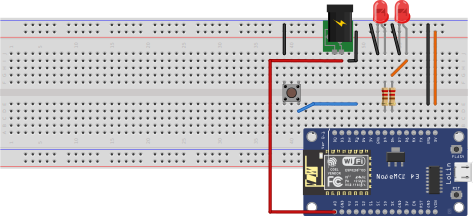

<a name="readme-top"></a>
<!-- PROJECT LOGO -->
<br />
<div align="center">
    

  <h3 align="center">OMA - Embbedded Device sensors</h3>

  <p align="center">
    Weather Station, Generator and PowerDelivery sensor code for microcontroller.
    <br />
    <br />
  </p>
</div>

<!-- TABLE OF CONTENTS -->
<details>
  <summary>Table of Contents</summary>
  <ol>
    <li>
      <a href="#about-the-project">About The Project</a>
      <ul>
        <li><a href="#built-with">Built With</a></li>
      </ul>
    </li>
    <li><a href="#getting-started">Getting Started</a></li>
    <li><a href="#usage">Usage</a></li>
  </ol>
</details>

<!-- ABOUT THE PROJECT -->
## About The Project

### Libraries used

Here are the libaries used in this project, these libaries is a must have, to be able to run the program, please remember to install the dependencies!

* [ArduinoMqttClient 0.1.8](https://github.com/arduino-libraries/WiFiNINA) by [Arduino](https://www.arduinolibraries.info/authors/arduino-libraries)
* [Adafruit BusIO 1.16.2](https://github.com/adafruit/Adafruit_BusIO) by [Adafruit](https://www.arduinolibraries.info/authors/adafruit)
* [Adafruit GFX Library 1.11.11](https://github.com/adafruit/Adafruit-GFX-Library) by [Adafruit](https://www.arduinolibraries.info/authors/adafruit)
* [Adafruit SSD1306 2.5.13](https://github.com/adafruit/Adafruit_Sensor) by [Adafruit](https://www.arduinolibraries.info/authors/adafruit)
* [Adafruit Unified Sensor 1.1.4](https://github.com/adafruit/Adafruit_Sensor) by [Adafruit](https://www.arduinolibraries.info/authors/adafruit)
* [ArduinoJson 7.2.0](https://easybtn.earias.me/) by [Benoit Blanchon](https://github.com/bblanchon)
* [DHT sensor library 1.4.6](https://github.com/adafruit/DHT-sensor-library) by [Adafruit](https://www.arduinolibraries.info/authors/adafruit)
* [Effortless-SPIFFS 2.3.0](https://thebigpotatoe.github.io/Effortless-SPIFFS/) by [thebigpotatoe](https://github.com/thebigpotatoe)
* [WiFiManager 2.0.17](https://github.com/tzapu/WiFiManager) by [tzapu](https://www.arduino.cc/reference/en/libraries)

<p align="right">(<a href="#readme-top">back to top</a>)</p>

<!-- GETTING STARTED -->
## Getting Started
To get started, you will need [Arduino IDE 2.3.3](https://www.arduino.cc/en/software) and then follow the [Steps to Setup Arduino IDE for NODEMCU ESP8266](https://www.instructables.com/Steps-to-Setup-Arduino-IDE-for-NODEMCU-ESP8266-WiF/).

When you ahve the software installed, then you can move onto cloning the code down into your work folder, and open it with the Arduino IDE. After that, please continue reading the sections under.

## Connecting to WiFi and the MQTT broker.
After flashing the code to the ESP8266, a Wi-Fi AP will now be visible, connect to the Wi-Fi, and a config portel will apear shortly after. In the config portal, you most follow these steps:
1. Setup: Please fill in the DCP MQTT Broker credentials, and leave the ClientId blank, to use the MAC address of the WI-Fi module.
2. Save and go back to the main page.
3. Wi-Fi: Click into the wifi settings, and configure the Wi-Fi.
4. Click Save: Wait for the device to connect to the Wi-Fi and broker (May need to restart).

<p align="right">(<a href="#readme-top">back to top</a>)</p>

## Diagram / connection diagram
This diagram shows how to connect the different modules / components to the ESP8266.

All the sensor types has 2x LEDS, that is used for the sensor states, and is controlled with the ChangeState action.
Green LED for "On", rd LED for "Off" and the build in LED for "ServiceMode"

### Weather Station - ESP8266
This this is the weather station sensor, that deliveres weather data.

Code can be found in folder: WeatherStation



#### Data sample
```JSON
{
    "Id": "MyDevice",
    "Type": "Weather",
    "Attributes": [
        {
            "Name": "Temperature",
            "Value": 24
        },
        {
            "Name": "Humidity",
            "Value": 60
        }
    ]
}
```

#### Pin connection

<ul>
  <li>
    <a href="https://ardustore.dk/produkt/display-oled-0-96-i2c-128x64-module-blaa-og-gul">Display OLED 0.96″ I2C 128×64 Module</a>
    <ul>
        I2C
        <li><strong>GND</strong> to <strong>GND</strong></li>
        <li><strong>VCC</strong> to <strong>3.3V</strong></li>
        <li><strong>SCK</strong> to pin <strong>D1</strong> on ESP8266</li>
        <li><strong>SDA</strong> to pin <strong>D2</strong> on ESP8266</li>
    </ul>
  </li>
  <li>
    <a href="https://ardustore.dk/produkt/led-diode-kit-3mm-and-5mm-375-dele">Green LED</a>
    <ul>
        <li><strong>+</strong> to <strong>47 Ω</strong></li>
        <li><strong>-</strong> to <strong>GND</strong></li>
        <li><strong>47 Ω</strong> to <strong>D5</strong></li>
    </ul>
  </li>
  <li>
    <a href="https://ardustore.dk/produkt/led-diode-kit-3mm-and-5mm-375-dele">Red LED</a>
    <ul>
        <li><strong>+</strong> to <strong>47 Ω</strong></li>
        <li><strong>-</strong> to <strong>GND</strong></li>
        <li><strong>47 Ω</strong> to <strong>D6</strong></li>
    </ul>
  </li>
  <li>
    <a href="https://ardustore.dk/produkt/tactile-push-button-switch-180-dele">Tactile Push Button Switch</a>
    <ul>
        <li><strong>Side 1</strong> to <strong>GND</strong></li>
        <li><strong>Side 2</strong> to <strong>D3</strong></li>
    </ul>
  </li>
  <li>
    <a href="https://ardustore.dk/produkt/dht-22-temperatur-fugtigheds-module">DHT-22</a>
    <ul>
    Communication Process: Serial Interface (Single-Wire Two-Way)
    <br/>
        <li><strong>SDA</strong> to <strong>SDA</strong> on ESP8266</li>
        <li><strong>GND</strong> to <strong>GND</strong></li>
        <li><strong>VCC</strong> to <strong>3.3V</strong></li>
        <li><strong>Signal</strong> to pin <strong>D7</strong> on ESP8266</li>
    </ul>
  </li>
</ul>

<p align="right">(<a href="#readme-top">back to top</a>)</p>

### Generator - ESP8266
This sensor meassueres the voltage of the generator of the turbine.

Code can be found in folder: Generator



#### Data sample
```JSON
{
    "Id": "MyDevice",
    "Type": "Generator",
    "Attributes": [
        {
            "Name": "Voltage",
            "Value": 1.36
        }
    ]
}
```

#### Pin connection
<ul>
  <li>
    <a href="https://ardustore.dk/produkt/led-diode-kit-3mm-and-5mm-375-dele">Green LED</a>
    <ul>
        <li><strong>+</strong> to <strong>47 Ω</strong></li>
        <li><strong>-</strong> to <strong>GND</strong></li>
        <li><strong>47 Ω</strong> to pin <strong>D5</strong> on ESP8266</li>
    </ul>
  </li>
  <li>
    <a href="https://ardustore.dk/produkt/led-diode-kit-3mm-and-5mm-375-dele">Red LED</a>
    <ul>
        <li><strong>+</strong> to <strong>47 Ω</strong></li>
        <li><strong>-</strong> to <strong>GND</strong></li>
        <li><strong>47 Ω</strong> to pin <strong>D6</strong> on ESP8266</li>
    </ul>
  </li>
  <li>
    <a href="https://ardustore.dk/produkt/tactile-push-button-switch-180-dele">Tactile Push Button Switch</a>
    <ul>
        <li><strong>Side 1</strong> to <strong>GND</strong></li>
        <li><strong>Side 2</strong> to pin <strong>D3</strong> on ESP8266</li>
    </ul>
  </li>
  <li>
    <a href="">Power Source</a>
    <ul>
        <li><strong>-</strong> to <strong>GND</strong></li>
        <li><strong>+</strong> to pin <strong>A0</strong> on ESP8266</li>
    </ul>
  </li>
</ul>

### PowerDelivery - ESP8266
This Sensor type meassueres the power deliveret from the turbine to the grid.

Code can be found in folder: PowerDelivery

The image is borrowed from DFROBOT, where the connection is the same as for the Generator.


#### Data sample
```JSON
{
    "Id": "MyDevice",
    "Type": "PowerDelivery",
    "Attributes": [
        {
            "Name": "amp",
            "Value": 2.36
        }
    ]
}
```

#### Pin connection

<ul>
  <li>
    <a href="https://ardustore.dk/produkt/led-diode-kit-3mm-and-5mm-375-dele">Green LED</a>
    <ul>
        <li><strong>+</strong> to <strong>47 Ω</strong></li>
        <li><strong>-</strong> to <strong>GND</strong></li>
        <li><strong>47 Ω</strong> to pin <strong>D5</strong> on ESP8266</li>
    </ul>
  </li>
  <li>
    <a href="https://ardustore.dk/produkt/led-diode-kit-3mm-and-5mm-375-dele">Red LED</a>
    <ul>
        <li><strong>+</strong> to <strong>47 Ω</strong></li>
        <li><strong>-</strong> to <strong>GND</strong></li>
        <li><strong>47 Ω</strong> to pin <strong>D6</strong> on ESP8266</li>
    </ul>
  </li>
  <li>
    <a href="https://ardustore.dk/produkt/tactile-push-button-switch-180-dele">Tactile Push Button Switch</a>
    <ul>
        <li><strong>Side 1</strong> to <strong>GND</strong></li>
        <li><strong>Side 2</strong> to pin <strong>D3</strong> on ESP8266</li>
    </ul>
  </li>
  <li>
    <a href="https://www.dfrobot.com/product-1486.html">Gravity: Analog AC Current Sensor (20A)</a>
    <ul>
        <li><strong>-</strong> to <strong>GND</strong></li>
        <li><strong>+</strong> to pin <strong>A0</strong> on ESP8266</li>
    </ul>
  </li>
</ul>

## MQTT - Topics

### Subsciption

#### device/outbound/ping
Ping from Central server, where the device responds with a beacon on topic: device/inbound/beacon.
#### device/outbound/{clientId}/settings
```JSON
{ 
    "CollectionInterval": 5 // seconds.
}
```
#### device/outbound/{clientId}/changestate
to change the state of the sensor
```JSON
{ 
    "Value": "On" // options: ["On", "Off", "ServiceMode"]
}
```

### Publish
#### telemetry
Endpoint for telemetry data
```JSON
{
    "Id": "MyDevice",
    "Type": "MyType",
    "Attributes": [
        {
            "Name": "MyAttribyte",
            "Value": 1
        }
    ]
}
```

#### device/inbound/beacon
Device beacon.
```JSON
{
    "Id": "MyDevice",
    "Type": "Weather",
    "State": "On",
    "CollectionInterval": 5,
}
```